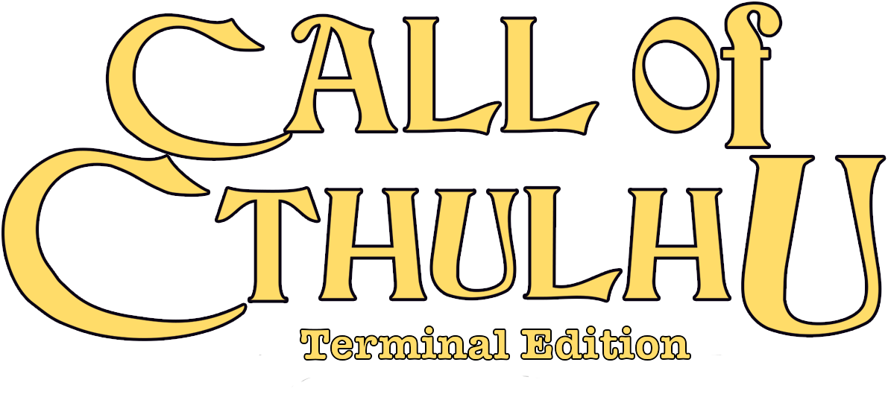

---
# PyCthulhu 


## Getting Started

The game is for now only in **Polish** language version, but I will add translations later.

### Prerequisites

You will need Python3 interpreter to run the code - you can get it [**here**](https://www.python.org/downloads/).

#### Required non-standard Libraries

`tabulate` - ver. 0.10.0

### Installation

Use the package manager [**pip**](https://pip.pypa.io/en/stable/) to install required dependencies.

```bash
pip install -r requirements.txt
```

Then you can run the code with
```bash
python pycthulhu.py
```
or
```bash
python3 pycthulhu.py
```
### Advice Info
For the best visual experience use terminal resolution of 136x36 (columns x rows).

## Authors

 - [**Jakub Michniewicz**](https://github.com/kubektkd) - idea & initial work 

## License

[GNU GPLv3](https://choosealicense.com/licenses/gpl-3.0/)
